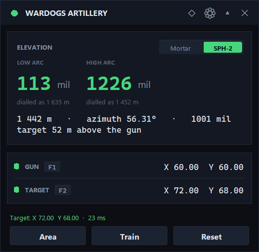
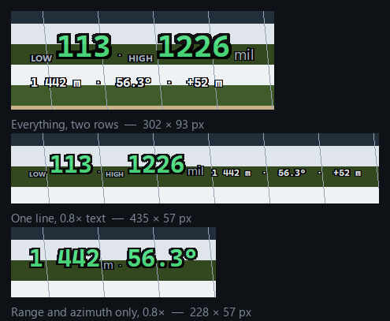
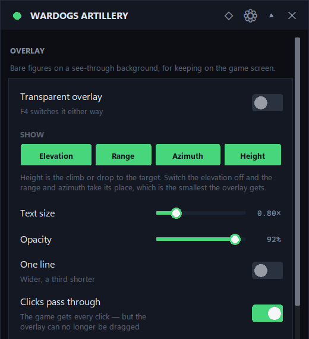

# WARDOGS Artillery Calculator

A portable Windows overlay for WARDOGS. Press a hotkey and it reads the map
coordinates off your screen, then shows the range, azimuth and the elevation
in mils to dial on the gun.

Separate process, no injection into the game: it reads the screen and listens
for a global hotkey, the same things OBS does.



## Install

1. Download `wardogs-calc.exe` from [Releases](../../releases/latest).
2. Run it. That's it — no installer, no Python, no admin rights.

Settings live in a `config.json` next to the exe, so the whole thing stays
portable: copy the exe anywhere, delete it and nothing is left behind.

## Use

1. In game, point at a spot on the map and press your mark-coordinates key.
   The chat opens with a line like `x98.49, y110.30` in the input field.
2. **F1** — gun position, **F2** — target, **F3** — clear both,
   **F4** — panel or transparent overlay.

The line stays in the chat until the message is sent, so there is no rush.
Each press overwrites its own point: to re-aim, mark a new spot and press
**F2** again — nothing needs resetting.

The big number is the **elevation in mils** — what you dial on the weapon.
The SPH-2 has two arcs, so it shows two. Range and azimuth sit below: those
you check, not enter. If an arc cannot reach, it says why instead of inventing
a number.

The elevation already accounts for the height difference between gun and
target, which the game shows nowhere and which matters more than it sounds:
Bakurani has a kilometre of relief, and half of all SPH-2 shots across it climb
or drop over 100 m, worth tens of mils. Under the figure you get the range the
table was read at once the slope moved it. Pick your map once under
`⚙ → Terrain` — both maps use the same coordinates, so a reading cannot tell
them apart.

If the coordinates do not read on your setup, press **Area** once and drag a
box around the chat line — a little wider and taller than the text, not tight
against it. Font templates are built in for the two sizes the HUD has been seen
at, 1440p and 1080p; **Train** is there for a screen that draws them at some
other size, and a failed read says which case you are in.

### Transparent overlay

**F4** drops the panel for a see-through overlay you can leave sitting on the
game: bare figures on a background Windows makes invisible, and it stays
exactly where the panel was — switching modes never moves the window. Every
string is drawn with a black halo, so it reads over snow as well as over
shadow. Clicks pass straight through to the game by default, which is also
why **F4** exists: with nothing to aim at, it is the way back. Turn that off
under `⚙ → Overlay` and the overlay can be dragged; double-clicking it also
returns to the panel.



The bands are a test backdrop rather than the game: nothing is drawn but the
text, so whatever lies underneath shows through — which is also why the halo
has to be there.

`⚙ → Overlay` is the first section on the settings page. **SHOW** is a row of
four chips — elevation, range, azimuth, height — each switching on its own.
**Text size** (0.6–1.5×) and **One line** decide the shape. Opacity is
separate from the panel's: bare text wants more of it than a slab does.



How small it gets, on a 1080p screen, against the panel's 400 × 417 px (7.7%
of the screen):

| overlay | size | share of 1080p |
|---|---|---|
| everything, two rows | 189 × 71 | 0.65% |
| everything, two rows, 0.7× | 160 × 53 | 0.41% |
| everything, one line, 0.7× | 221 × 38 | 0.40% |
| range + azimuth | 184 × 55 | 0.49% |
| range + azimuth, 0.6× | 114 × 33 | 0.18% |
| azimuth alone | 99 × 55 | 0.26% |

Fonts and gaps stop shrinking before they stop being legible, so the size
slider bottoms out around 0.6× rather than dissolving the small line.

## Settings

The `⚙` button opens seven sections: **Hotkeys**, **Coordinates**
(strictness, readout area, font training), **Terrain** (height correction
on/off, which map), **Screen capture**, **Appearance** (theme, five accents,
opacity, 0.8–1.6× scale, always-on-top), **Overlay** (transparency,
click-through, opacity, which figures to show) and **Diagnostics**. Everything
applies immediately.

**Rebinding:** click the button showing the current key and press what you
want. Mouse buttons work too — side, middle, right, wheel. Hold
`Ctrl`/`Shift`/`Alt`/`Win` for a combination, `Esc` cancels. The left button
is reserved, since that is how you operate the app.

**Why function keys:** the chat input holds keyboard focus while the line is
being read, so a digit or letter would be typed straight into it. The app
flags a hotkey that does this. Avoid `F12` (Steam screenshot) and
`Shift+Tab` (Steam overlay); if F1–F4 are taken in game, F9–F11 are usually
free.

## How it works

A map position is an X/Y pair on a `0 … 163.84` scale spanning the full
16.384 × 16.384 km terrain, so one unit is 100 m and `0.01` is one metre.

```
dx = (x2 - x1) * 100                       # metres
dy = (y2 - y1) * 100
range     = hypot(dx, dy)
azimuth   = atan2(dx, dy)                  # 0° = north (+Y), clockwise
mil       = azimuth * 6400 / 360           # NATO mils
dz        = height(target) - height(gun)   # from the terrain, see below
elevation = interpolate(firing table, equivalent_range(range, dz), weapon, arc)
```

| Weapon | Working range | Elevation | Arcs |
|---|---|---|---|
| Mortar (L81) | 132 – 684 m | 850 → 150 mil | one high angle, 84 points |
| SPH-2 | 780 – 2629 m | low 20 → 600 mil, high 1390 → 620 mil | low arc from 1181 m (59 points), high 80 points |

Elevation figures are community measurements — nothing official was ever
published, so re-check them after a game patch and edit
[`firing_tables.json`](src/wardogs_calc/firing_tables.json) to suit. The
format is `[range_m, mil]`, in any order. Each weapon's `model` block is
fitted to its own rows, so re-measuring the table means refitting the model
with it.

### Height

The tables were measured on level ground and are keyed on horizontal range, so
by themselves they answer the wrong question. Bakurani has 1082 m of relief:
sample random gun/target pairs across it at the ranges the SPH-2 covers and the
median height difference is 109 m, the top tenth over 320 m. At 1800 m a 100 m
climb is worth about 33 mil — far more than the tables' own precision.

Heights come from the terrain itself. The game's Landscape collision height
field carries no usable absolute datum — it sits some 900 m below anything a
player would call an altitude — but it is internally consistent, and only the
difference between two points is ever used. It is sampled every 8 m, stored per
map relative to that map's own lowest point, and takes 3 MB for both maps.
Interpolating that grid instead of the full 2 m data is off by 0.13 m on
average and 0.45 m at the 95th percentile: under half a mil.

Turning a height difference into an elevation needs a trajectory, which no
table can supply, so the projectile is modelled: a point mass under gravity and
quadratic air drag. Its constants were not guessed but recovered from the
firing tables themselves. Left free, the drag exponent came out at 1.99, which
is the strongest sign the shape of the model is right; the SPH-2's two arcs,
which one set of constants has to satisfy at once, then pin the rest down to a
single answer — 226.0 m/s and a drag coefficient of 2.87e-4 per metre,
reproducing all 139 rows of both arcs to 2.6 m.

The model never supplies the elevation. It answers one question — *what level
shot needs the same dial as this sloped one?* — and the elevation is read from
the table at that **equivalent range**:

```
elevation = table( equivalent_range(range, dz) )
```

A level shot's equivalent range is its own, so nothing about the old behaviour
changes; uphill reads longer, downhill shorter, and the figure is shown under
the elevation. Anchoring this way keeps the fit's few metres of range error out
of the answer, because it cancels between the sloped shot and the level one it
is measured against. Whether the gun will fire at all is judged on the
equivalent range too, since that is what the dial is set to — so a target
below you can sit past the flat maximum and still be reachable, and one above
you can be inside it and not be.

The correction was cross-checked against
[apollyon-sys/wardogs-calculator](https://github.com/apollyon-sys/wardogs-calculator),
which derived the same relationship independently by numerical integration.
Their firing tables are byte-identical to these, and where their data is
confident the two agree to 1.9 mil on the low arc and 2.9 mil on the high one.
The remaining difference is systematic, about 8% of the correction, and settling
it needs a shot measured in the game rather than more arithmetic.

### Reading the coordinates

The readout area is captured, binarised at up to seven thresholds — four
absolute, three read off the crop's own histogram so that a screen drawing the
HUD smaller is still seen — split into connected blobs, matched against a bank
of glyph templates and parsed. The whole read takes 20–40 ms. Recognition
anchors on the `x` and `y` labels, so clutter beside the line does not matter,
and a miss is retried once on a box 2.2× wider around the same centre.

The bank holds one group per render size, and a line commits to one group
rather than letting every face vote glyph by glyph. It matters more than it
sounds: at 1080p the game draws its digits 6×11 where 1440p gives 9×13 —
narrower relative to their height, not merely smaller, because the rasteriser
snaps stems to the pixel grid at that size. Templates normalise onto a square,
so a different aspect is a different shape, and the 1440p group read a real
1080p line as `.0000 .y.y0062`. With its own group it reads.

Template matching rather than a general OCR engine: the HUD font is fixed, it
keeps 50 MB of third-party binaries out of the exe, and a font that reads
badly can be retrained in a dozen keystrokes.

The decimal point is the fragile part. At 1080p it is one or two lit pixels,
so segmentation loses it, and the gap it leaves measures the same as the space
after the pair's comma — on a real crop both were 5 px against a 4.7 px
threshold, so nothing separates them by width. What separates them is shape:
the readout always prints exactly two decimals, so a number broken by one gap
with exactly two digits after it can only be that number with its point
knocked out. That is rejoined; a bare run of digits gets its point put back
two from the right, and is never read at face value, because a `y110` that
came off a two-decimal readout means 1.10 and not 110.

The chat input's caret is dropped rather than matched. It is a solid bar
standing half again taller than the text, and read as a glyph it came back as
a 9 — turning `y110.18` into an unparseable `y110189`.

Six guards stand between a bad crop and a wrong firing solution:

1. **Both `x` and `y` labels are required.** No "take the first two numbers"
   fallback — that would silently swap the axes one day, which is plausible,
   in range and completely wrong.
2. **Each axis is bounded separately.** The playable strip is much narrower
   than the terrain, so a clipped `y99.07` read as `y9.07` lands off the map
   and is thrown away.
3. **Binarisation thresholds must agree.** Taking the first threshold that
   merely parses is unsafe: an aggressive one clips the tail off a 9, reads it
   as a 0 and hands back a well-formed wrong number. Mangling thresholds
   disagree with each other; correct ones agree.
4. **An unrecognised glyph comes back as `?`** and invalidates any number it
   touches — `x83.?2` never degrades into `83`.
5. **A dot-less reading is never taken literally.** The point goes back two
   digits from the right or the reading is refused. Accepting `y110` as 110
   was a way to report a target 21 m from where it stands: in range,
   well-formed and wrong.
6. **The second point cannot equal the first.** The chat line stays put until
   sent, so a press without a fresh mark would otherwise report a confident
   range of zero.

When a read fails the stored point is left alone and the status line says what
to try next.

### Screen capture

| Backend | When it is needed |
|---|---|
| `bitblt` (mss) | windowed and borderless fullscreen |
| `dxgi` (dxcam) | exclusive fullscreen, where GDI returns a black frame |
| `auto` | starts on bitblt, switches to dxgi once if a frame comes back blank |

`dxcam` is optional. Without it, exclusive fullscreen reports a blank frame
and suggests switching the game to borderless.

## If something does not work

1. **Hotkeys do not respond in game.** A low-level hook gets no input from a
   process running at a higher integrity level. If the game runs as
   administrator, run this as administrator too. Current rights are shown
   under Diagnostics.
2. **The hotkey is a printable key** — it types into the chat line. Use a
   function key.
3. **Same point for gun and target.** The chat line did not change; mark a new
   spot. The app catches this and says so.
4. **Capture returns a black frame.** Switch the backend to DXGI, or put the
   game in borderless windowed mode.
5. **Coordinates do not read.** Press **Area** and select the line. If that
   does not help, check `debug/wardogs.log` and turn on "Save snapshots" to
   see exactly what lands in the area.

The log is always written to `debug/wardogs.log` next to the exe and rolls
over at 512 KB. It shows whether the hotkey fired at all, which area was used,
what each threshold found, what was recognised and how long it took:

```
start: v1.2.0, screen (2560, 1440), standard user, config ...\config.json
  hotkeys f1 / f2 / f3 / f4, weapon mortar
  font: 161 templates in ['wardogs', 'wardogs-1080'], characters .0123456789xy, margin 0.05
  area (358, 475, 665, 187), saved None, default [0.14, ...]
  height correction on, Bakurani 1531x1531 at 8 m, X 20.40..142.80 Y 10.20..132.60
hotkey: gun
read: area (358, 475, 665, 187) - default, screen (2560, 1440)
  read X 98.49  Y 110.30 in 21 ms (text 'x98.49, y110.30', font wardogs, ...)
```

No `hotkey:` line at all means the press never reached the app — that is a
rights or binding problem, not a recognition one.

## Building from source

```bash
run.bat      # run from source
build.bat    # produce dist\wardogs-calc.exe (~30 MB)
py -3 -m pytest tests/ -q
```

```
main.py                     entry point, also PyInstaller's
src/wardogs_calc/
  ballistics.py             range, azimuth, mils, firing tables
  firing_tables.json        the tables and each weapon's model (edit here)
  trajectory.py             the projectile model behind the height correction
  terrain.py                height lookup
  terrain/                  height grids, 8 m, one file per map (3 MB)
  capture.py                screen capture, two backends
  hotkeys.py                pass-through WH_KEYBOARD_LL / WH_MOUSE_LL hooks
  reader.py                 capture + recognition
  config.py                 portable config.json
  vision/                   binarisation, segmentation, glyph matching
  ui/                       window, settings, theme, widgets, trainer
tests/                      224 tests
```

## Limits

- Pick the right map under `⚙ → Terrain`. Both maps use the same coordinate
  scale, so a reading cannot say which one you are on, and the height it is
  read against comes from whichever map is selected. A point outside the
  selected map's area says so instead of guessing.
- The height correction is as good as the model behind it, which is a fit to
  the same community tables rather than anything measured in the game. The
  SPH-2's two arcs pin its model to a single answer. The mortar has one arc,
  which cannot separate muzzle speed from drag: fits from 146 to 214 m/s match
  its table equally well, and they disagree by 40% on how large a correction
  to apply. They agree on the direction and the rough size, so the mortar's
  correction is worth having and is not settled to the last mil. Both weapons
  beat ignoring the height, which is what a bare table does.
- Vehicle tilt is not corrected. On the SPH-2, park level: the two markers
  either side of the silhouette under `STABILIZED / ASL` in the gunner HUD
  show lateral tilt, and a slope under the tracks moves the shot in a way no
  map data can see.
- The window is frameless, so it does not appear in the taskbar or Alt+Tab.
  Collapse it with `▴`.
- The left mouse button cannot be bound; it operates the app itself.

## Licence

MIT — see [`LICENSE`](LICENSE). Not affiliated with or endorsed by BULKHEAD or
the WARDOGS development team.

The MIT licence covers this project's own code. The height grids under
[`src/wardogs_calc/terrain/`](src/wardogs_calc/terrain/) are decimated from
WARDOGS terrain data, extracted and published by
[apollyon-sys/wardogs-calculator](https://github.com/apollyon-sys/wardogs-calculator)
(MIT for its code, which explicitly does not extend to game-derived material).
That data remains the property of its copyright holders and is included here on
the same footing: unofficial, fan-made, and claiming no ownership of anything
belonging to WARDOGS.
